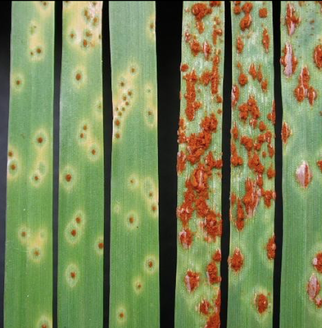
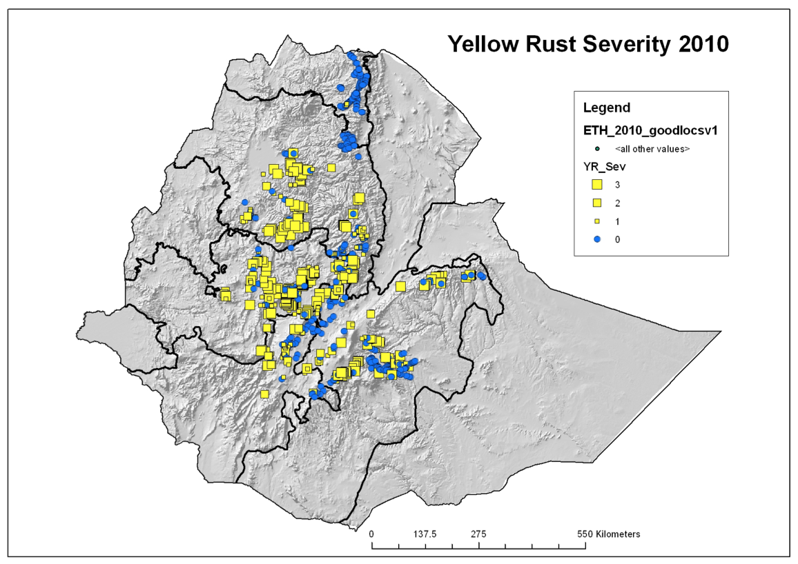
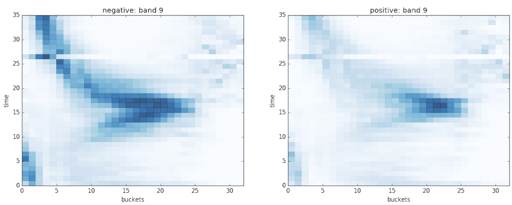

# Description

At a high level, this project tries to train machine learning models on satellite imagery in order to discover fungal outbreaks among Ethiopian wheat fields. 

The pathogen we're concerned with is named *Puccinia triticina* and is commonly referred to as wheat rust. It comes in three types (yellow, stripe, leaf) and looks like this:

### Data

For labels, we have close to 10,000 field-level observations taken over the course of a decade. These surveys were conducted by the folks at [RustTracker.org](http://rusttracker.cimmyt.org/) Each observation has a latitude, longitude, date, and infection severity rating for three strains of our pathogen. Below is a subset of the data for the 2010 growing season.

For examples, we are using photos taken from two NASA spacecraft: Terra and Aqua. These photos come from a product called MODIS. We selected this product due to its high temporal resolution (8 days). To reduce the dimensionality of this imagery, we train models on histograms of pixel frequencies as one moves through time. Example histograms for healthy (left) and diseased (right) fields are below:

### Model

To learn on these data, we experimented with a variety of linear and nonlinear classifiers. As of 3/5/17, it appears that deep learning models that cook up their own representations of the data work best. These include 
* Recurrent Neural Networks & LSTMS
* Feed-Forward Nerual Networks
* Convolutional Neural Networks. 

