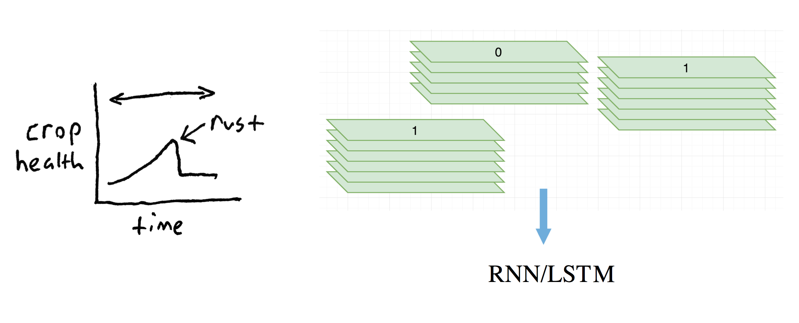

# Pixel-level Classification

This directory contains four attempts to classify Ethiopian wheat health on the per-field level.

Since our observations are at the per-field level, this approach seemed the simplest and most straightforward way to tackle the problem. Unfortunately, the spatial resolution of our MODIS imagery is 500m per pixel. This means that multiple farms may be swallowed by a single pixel in our training data. It is likely due to this problem that none of the following methods worked very well. 

## Methods

#### 1: Raw pixel classifier

Sample a timeseries of pixels for each survey location. Select the pixels whose dates are closest to that of the survey observations. Label each pixel with the crop health reported in its corresponding observation.


In the above image, three pixel timeseries are depicted. Their labels are shown on top, and the selected pixels are shown in red.

#### 2: Pixel Delta Classifier

Infected wheat should suffer from its illness. This observation informed our second attempt. This time, we follow the same steps outlined above, but find the pixel that corresponds to "peak green" - when the wheat is at its peak - with

```
       peak green = max_{i in pixels}  [ near_infared_i / red_i ]
```
and differences this "peak pixel" with a pixel from one month later. The intuition here is that infected crops should have a sudden drop-off in field health.


#### 3: RNN Classifier

Similar data collection schemes as # 1 and 2, but use a Recurrent Neural Network for our classifier. This lets us feed in the whole timeseries and model temporal structure of the whole year.



#### 4: RNN Growing Season

Same as # 3, except restrict the timeseries to the Ethiopian wheat growing season (~July - Febuary).


