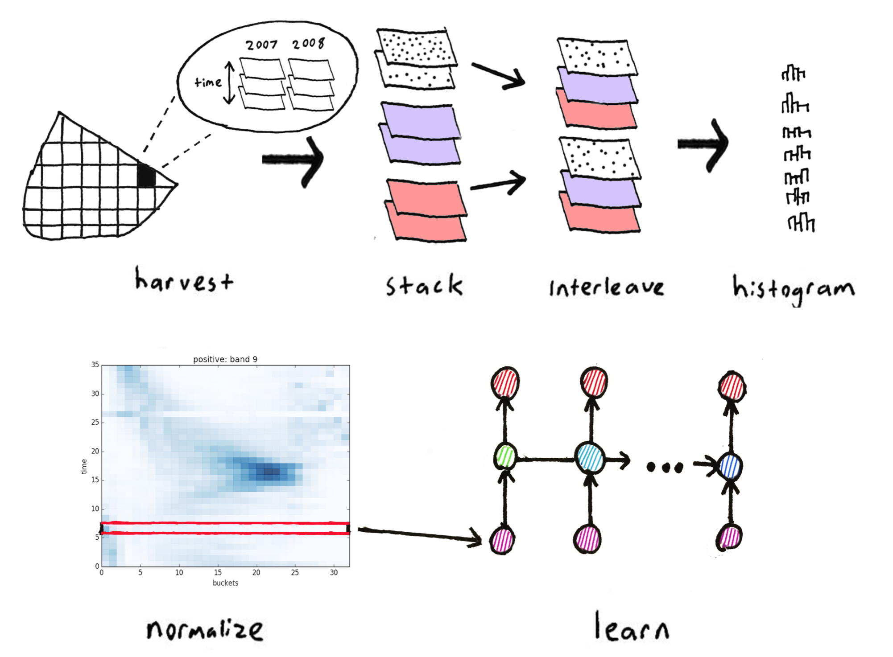

# Description

This is our second major approach to the problem, and it seems like this one works. Instead of trying to predict rust infections at the *per-field* level, we aggregate observations into broader spatial regions and predict the presence of rust *outbreaks* for each region. 

## Method

The above image depicts the pre-processing steps before training. They are as follows:

1. Download a timeseries of images that are fitted to each Ethiopian district for each growing season. These images come from three MODIS products: surface reflectance, gross photosynthesis, and temperature.

2. Stack each image, i.e. turn `X` images of `Y` bands each into a single image with `X * Y` bands.

3. Interleave the bands of each source to produce meta-image stacks for each growing season.

4. Reduce the dimensionality of these data by histogramming on pixel frequencies for each timestep.

5. Normalize each bucket across time (0 mean, unit varience). 

6. Feed these histograms into a recurrent neural network, and predict whether there was 
  * an outbreak of wheat (on average, observations were infected)
  * no outbreak (on average, observations were healthy)

